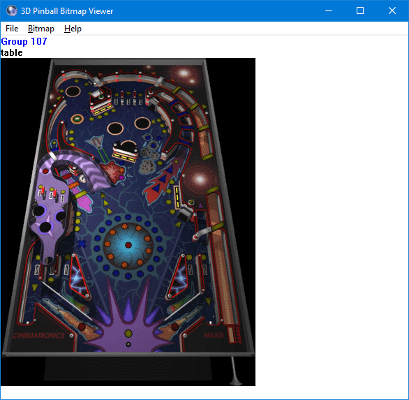

# PinballTools

This repository contains some tools and documents for viewing and modding
Cinematronics' Full Tilt Pinball and 3D Pinball Space Cadet files.

I began making them in 2014 and ended development in 2017, but I haven't decided to release them as they were really very basic.

However recently someone contacted me to ask me how I managed to extract some unused part of the table that I posted on [Space Cadet's TCRF article](https://tcrf.net/3D_Pinball:_Space_Cadet), so now here are the tools that I used to extract it. :)

Not sure if I will continue reversing the game, but if I do, I will probably rewrite them, because the current code written in pure C is a mess and not something great to continue development, unless someone made better tools than me, which is what I hoped and another reason why I didn't release the tools in the first place. But apparently there aren't many modding tools for the games yet, despite the 3D Pinball Space Cadet being very popular :thinking:, as it was shipped with certain versions of Windows.

There are two tools:
 * a BMP Viewer, to view and edit the sprites of the game from the PINBALL.DAT file.
 * a DAT Parser, which prints out headers and objects in the DAT file.

## BMP Viewer (pbwbmpvw.exe) instructions:
 * Open the PINBALL.DAT file first using File > Open in the menu, or by drag-dropping the file on the pbwbmpvw.exe executable file.
 * Press Right or Down to go to the next sprite.
 * Press Left or Up to go to the previous sprite.
 * Press Home/End to go to the first/last sprite.
 * Press Tab to see the collision of the sprite ???
 * To export a sprite to a BMP file, click Bitmap > Export.
 * To import a sprite to a BMP file, click Bitmap > Export. The format of the sprite should be similar to what is exported by the program, that is it must be an 8 bits per pixel indexed/paletted picture (using the same palette). If it still doesn't work, try saving from different programs, for example IrfanView.

## Compiling

To compile the tools, just open a Windows SDK or Visual C++ command prompt, then:
 * for the BMP Viewer, go to the bmp_viewer directory, build the resources file with `rc pbwbmpvw.rc`, and then run `build.bat`
 * for the DAT parser, go to the dat_parser directory, and just do `cl pbwdlist.c`
